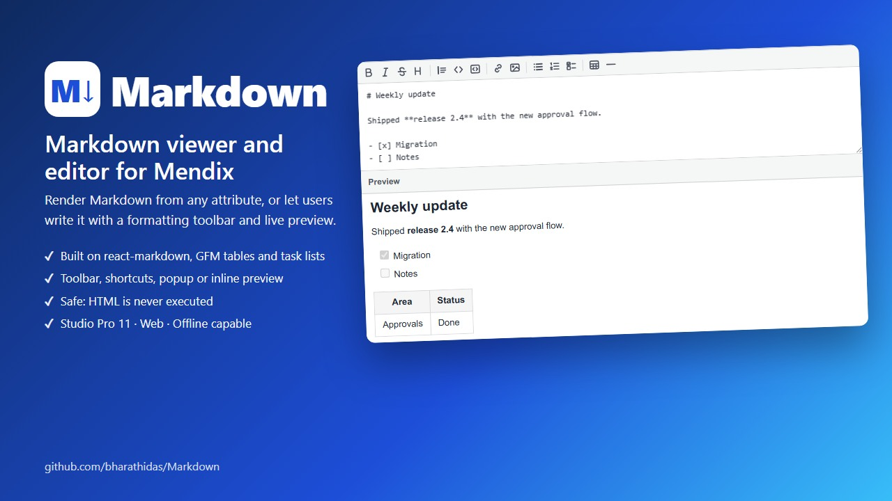
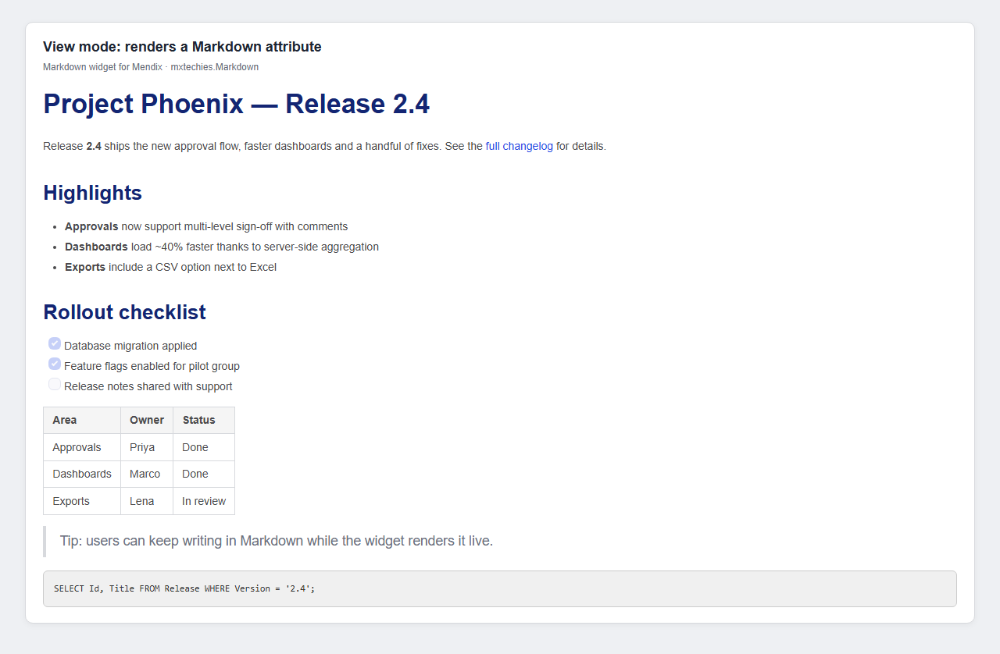
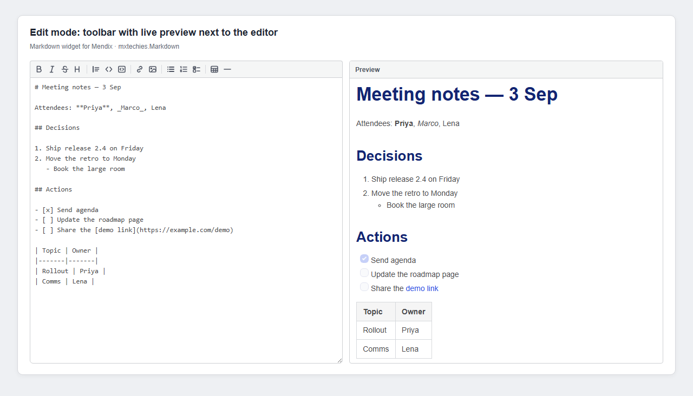
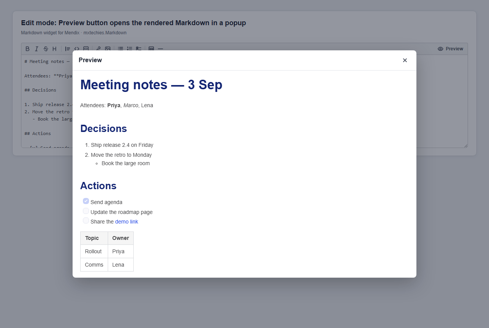
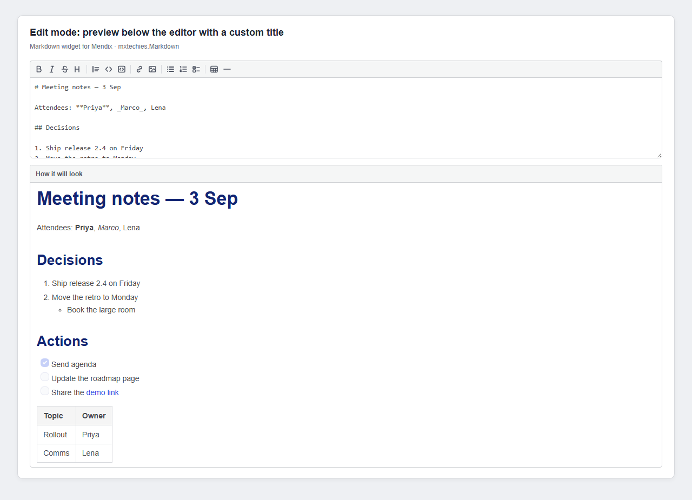
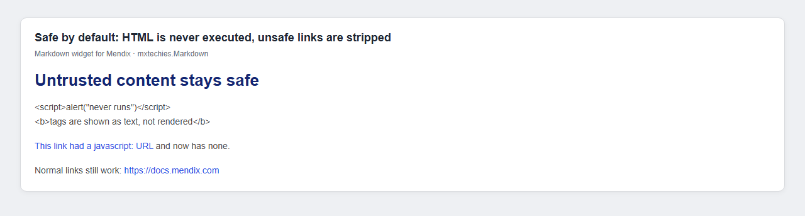
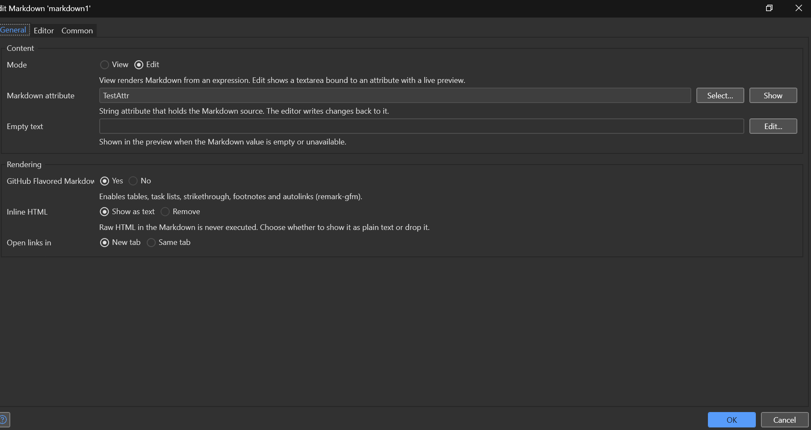
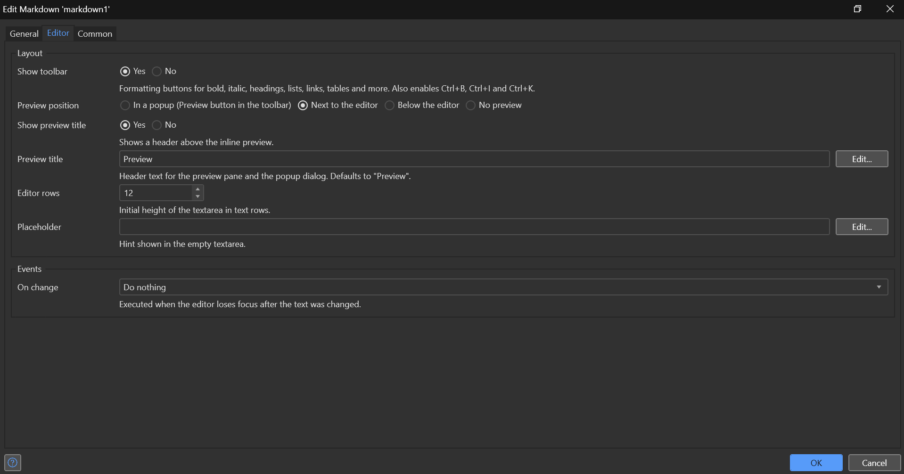

# Markdown Editor widget for Mendix

Render Markdown from any attribute or expression, or let users write it
themselves with a formatting toolbar and a live preview. The widget wraps the
[react-markdown](https://www.npmjs.com/package/react-markdown) library and
keeps stored content as plain, portable Markdown text. Raw HTML in the content
is never executed.

Version 1.0.0 · Mendix Studio Pro 11.12.1 and higher · Web

## Typical usage

- Show **release notes, help text, policies or product descriptions** that are
  authored in Markdown and kept in a String attribute.
- Render **content coming from APIs, AI models or documentation systems** that
  already produce Markdown, without converting it to HTML on the server.
- Give users a **lightweight rich-text editor** for comments, notes,
  descriptions or knowledge-base articles, while keeping the stored value as
  portable plain text.
- Let authors **preview what they write**, next to the editor or in a popup,
  before they save.
- Display **tables, task lists, code blocks and links** in a consistent style
  that follows your Atlas theme.

## Features

### Two modes in one widget

| Mode | What it does |
|---|---|
| **View** | Renders a string expression as formatted Markdown. Use an attribute, a literal, or any expression that returns a string. |
| **Edit** | Shows a textarea bound to a String attribute, with a formatting toolbar and a live preview. Writes changes straight back to the attribute. |

### Rendering

- **GitHub Flavored Markdown** (tables, task lists, strikethrough, footnotes
  and autolinks) via remark-gfm, switchable per widget.
- **Safe by default.** Raw HTML inside the Markdown is never executed. Choose
  to show it as plain text or drop it. Unsafe link protocols such as
  `javascript:` are stripped.
- **Links** open in a new tab with `rel="noopener noreferrer"`, or in the same
  tab.
- **Empty text** placeholder when the value is empty or still loading.
- Output is wrapped in `.widget-markdown` with light default styling for
  headings, lists, code, tables, blockquotes and images, so it can be themed
  from your Atlas styles.

### Editor

- **Formatting toolbar** with bold, italic, strikethrough, heading (cycles H1
  to H3), quote, inline code, code block, link, image, bullet list, numbered
  list, task list, table and horizontal rule. Buttons wrap or toggle the
  current selection and keep the caret in place.
- **Keyboard shortcuts**: Ctrl+B, Ctrl+I and Ctrl+K (Cmd on macOS).
- **Preview position**: in a popup dialog opened from a Preview button in the
  toolbar (default), next to the editor, below the editor, or hidden.
- **Preview title**: a translatable text template shown as the header of the
  inline preview and as the popup title.
- **Read-only and validation aware.** A read-only attribute disables the
  editor, and attribute validation messages appear below it in the standard
  Mendix style.
- **On change** action that runs when the editor loses focus after the text
  was changed.
- Editor rows, placeholder and toolbar visibility are configurable.

## Screenshots

| | |
|---|---|
|  View mode renders a Markdown attribute |  Edit mode with toolbar and live preview next to the editor |
|  Preview button opens the rendered Markdown in a popup |  Preview below the editor with a custom title |
|  HTML is never executed, unsafe links are stripped |  Studio Pro properties, General tab |
|  Studio Pro properties, Editor tab | |

## Installation

1. Download `mxtechies.MxTechiesMarkdown.mpk` from the
   [latest release](https://github.com/bharathidas/Markdown/releases/latest)
   and copy it into your app's `widgets` folder, or in Studio Pro use
   **App Explorer > Import module package**.
2. Press **F4** (Synchronize App Directory) to refresh the toolbox.
3. The widget appears in the toolbox under **Add-ons** as **Markdown Editor**.
4. Drag it onto a page inside a data view or list view.
   - View mode: set **Markdown** to an expression such as `$currentObject/Body`.
   - Edit mode: pick a String attribute; the toolbar and Preview button appear.

## Configuration

### General > Content

| Property | Description |
|---|---|
| Mode | *View* renders Markdown from an expression. *Edit* shows a textarea bound to an attribute with a toolbar and live preview. Default is View. |
| Markdown | (View mode) String expression with the Markdown source, for example `$currentObject/Body` or a string literal. |
| Markdown attribute | (Edit mode) String attribute that holds the Markdown source. The editor writes changes back to it. An unlimited-length attribute works best. |
| Empty text | Text shown in the preview when the Markdown value is empty or unavailable. |

### General > Rendering

| Property | Description |
|---|---|
| GitHub Flavored Markdown | Enables tables, task lists, strikethrough, footnotes and autolinks (remark-gfm). Default is Yes. |
| Inline HTML | Raw HTML in the Markdown is never executed. *Show as text* (default) displays it as plain text; *Remove* drops it. |
| Open links in | *New tab* (default, with `rel="noopener noreferrer"`) or *Same tab*. |

### Editor > Layout (Edit mode only)

| Property | Description |
|---|---|
| Show toolbar | Formatting buttons for bold, italic, headings, lists, links, tables and more. Also enables Ctrl+B, Ctrl+I and Ctrl+K. Default is Yes. |
| Preview position | *In a popup* (default) shows a Preview button in the toolbar that opens a dialog. *Next to the editor* and *Below the editor* show a live preview pane. *No preview* hides it. |
| Show preview title | Shows a header above the inline preview pane. Default is Yes. |
| Preview title | Header text for the preview pane and title of the popup dialog. Translatable. Defaults to "Preview". |
| Editor rows | Initial height of the textarea in text rows. Default is 12. |
| Placeholder | Hint shown in the empty textarea. |

### Editor > Events

| Property | Description |
|---|---|
| On change | Microflow or nanoflow executed when the editor loses focus after the text was changed. Combine with a Save button or a commit in the action to persist the attribute. |

## Toolbar

| Button | Shortcut | What it does |
|---|---|---|
| Bold, Italic, Strikethrough, Inline code | Ctrl+B, Ctrl+I | Wraps the selection, inserts a placeholder when nothing is selected, and toggles off when applied again |
| Heading | | Cycles the current line through H1, H2, H3 and back to plain text |
| Quote, Bullet list, Numbered list, Task list | | Prefixes every selected line and toggles off when all lines already carry the prefix |
| Link, Image | Ctrl+K | Uses the selection as the label, or as the URL when a URL is selected, then highlights the part still to fill in |
| Code block, Table, Horizontal rule | | Inserts a block on its own lines |
| Preview | | Shown when Preview position is *In a popup*. Opens the rendered Markdown in a dialog. Close with Esc, the close button or a click outside |

## Safety

Content is treated as untrusted. HTML tags inside the Markdown are shown as
text or removed, never rendered or executed. Link URLs with unsafe protocols
such as `javascript:` are stripped. The rendering library is compiled into the
widget, so there is no CDN request at runtime and the widget is marked offline
capable.

## Limitations

- **Web only.** The widget does not appear in the toolbox for native mobile
  pages.
- **No raw HTML rendering** by design. Use the HTML Element widget if you need
  to render HTML.
- **No syntax highlighting** inside code blocks. Code is rendered in a
  monospace block without colouring.
- **No image upload.** The image button inserts Markdown image syntax that
  points at a URL you provide.
- **Edit mode needs a data context.** The Markdown attribute must come from a
  surrounding data view or list view.

## Dependencies

- Mendix Studio Pro 11.12.1 or higher (web, React client).
- No Marketplace module dependencies. react-markdown and remark-gfm are
  bundled inside the widget.

## Frequently asked questions

**Does this work on native mobile pages?**
No. The widget is web-only.

**Can I use it just to display Markdown, without editing?**
Yes. Keep **Mode** on *View* and set **Markdown** to any string expression.
The widget then renders it read-only.

**Is it safe to render Markdown that users or external systems supply?**
Yes. HTML inside the Markdown is never executed, and unsafe link protocols are
removed. You can also choose to strip HTML entirely.

**How do I save what the user typed?**
The editor writes every change straight to the bound attribute. Add a Save
button, or use the **On change** action to commit or validate.

**Where does the preview show?**
By default a **Preview** button in the toolbar opens a popup. You can also
show it next to the editor, below it, or hide it.

**Can I change the "Preview" heading?**
Yes. Set **Preview title** to any text or expression. It is translatable per
language.

**Can I turn off tables and task lists?**
Yes. Switch off **GitHub Flavored Markdown** to render only standard
CommonMark.

**Does it call out to the internet?**
No. The rendering library is compiled into the widget bundle. There is no CDN
request at runtime, and the widget is marked offline capable.

## Repository layout

- [`markdown/`](markdown/) holds the widget source.
- `widgets/mxtechies.MxTechiesMarkdown.mpk` is the prebuilt package.
- The rest of the repository is the Mendix test app
  (`PlugableWidget_Markdown.mpr`) used to develop and try the widget.

## Issues, suggestions and feature requests

https://github.com/bharathidas/Markdown/issues
